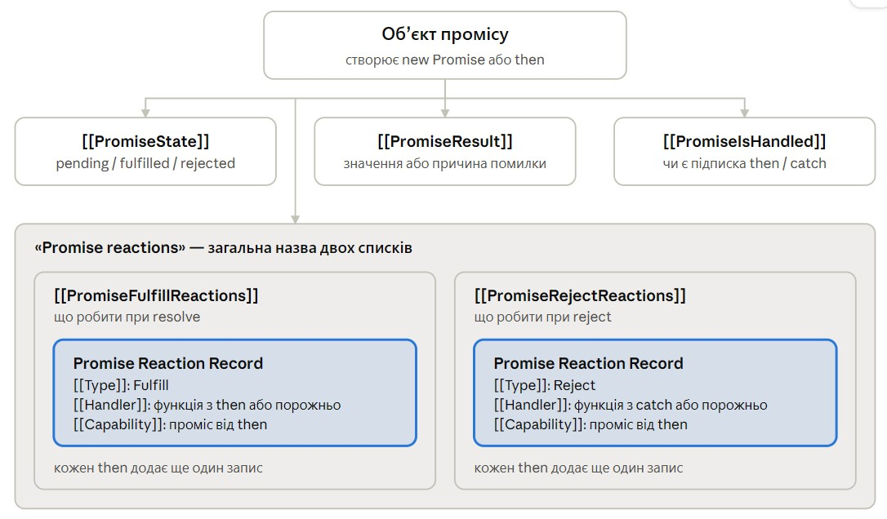

# Проміси та асинхронність у JS

Oct 5, 2026 · @Shadow

## 1. Конспект відео: JavaScript Visualized — Promise Execution (0:00–6:27)

Відео Lydia Hallie: [youtube.com/watch?v=Xs1EMmBLpn4](https://www.youtube.com/watch?v=Xs1EMmBLpn4). Нижче — її пояснення по порядку, моїми словами, з уточненнями там, де вона спрощує.

**\[0:21\] Створення промісу.** Проміс створюється конструктором `new Promise`, який приймає функцію-executor. У момент виконання `new Promise(...)` у пам'яті з'являється об'єкт промісу з внутрішніми полями (слотами):

- `[[PromiseState]]` — стан промісу;
- `[[PromiseResult]]` — результат;
- `[[PromiseFulfillReactions]]` — що зробити при успіху;
- `[[PromiseRejectReactions]]` — що зробити при помилці;
- `[[PromiseIsHandled]]` — чи обробив хтось цей проміс.

Разом з об'єктом ми отримуємо функції `resolve` і `reject`, які нам передає executor.

**\[0:45\] resolve і reject.** `resolve('done')` ставить `PromiseState` у `fulfilled`, а `PromiseResult` у `'done'`. `reject('fail')` ставить `PromiseState` у `rejected`, а `PromiseResult` у `'fail'`. Нічого особливого: це звичайний виклик функції, яка змінює поля об'єкта.

**\[1:16\] Особливе — reaction records.** У полях `[[PromiseFulfillReactions]]` і `[[PromiseRejectReactions]]` лежать **Promise Reaction Records**. Такий запис створюється, коли до промісу чіпляють `.then` або `.catch`. Сам запис створює метод `then`. Серед інших полів у записі є **handler**, і код цього handler'а — це колбек, переданий у `then`.

**\[1:49\] Що відбувається при resolve:**

1. `resolve` потрапляє в call stack.
2. `PromiseState` стає `fulfilled`, `PromiseResult` — переданим значенням.
3. Handler із reaction record отримує цей результат.
4. Handler **додається в чергу мікрозадач**. Саме тут з'являється асинхронна частина промісів.

**\[2:14\] Нагадування про event loop.** Коли call stack порожній, event loop спочатку перевіряє чергу мікрозадач. Тільки коли вона порожня, він бере наступну задачу з черги задач (macrotask queue). Мікрозадачі мають пріоритет.

**\[2:31\] Навіщо executor на практиці.** Зазвичай у executor запускають асинхронну дію: читання файлу, мережевий запит або таймер. Коли вона повертає дані, в її колбеку викликають `resolve` з даними або `reject`, якщо сталася помилка.

**\[3:00\] Покрокове виконання з таймером.** Код приблизно такий:

```js
new Promise((resolve) => {
  setTimeout(() => resolve('done'), 100)
}).then((result) => console.log(result))
```

1. `new Promise` потрапляє в call stack і створює об'єкт промісу.
2. Викликається executor. `setTimeout` потрапляє в стек і **планує таймер** на 100 мс з колбеком, який пізніше викличе `resolve`.
3. `.then` потрапляє в стек і **створює reaction record** з handler'ом `(result) => console.log(result)`. Потім `then` знімається зі стеку.
4. Минуло 100 мс: колбек таймера потрапляє в **чергу задач**.
5. Скрипт закінчився, стек порожній. Колбек таймера переходить у стек і викликає `resolve`: стан стає `fulfilled`, результат `'done'`, handler іде в **чергу мікрозадач**.
6. Стек знову порожній. Event loop бере handler з мікрочерги, і він виводить `'done'`.

**\[4:21\] Чому це добре.** Поки handler чекає своєї черги, скрипт виконується далі і сторінка лишається інтерактивною. Handler потрапляє в стек тільки тоді, коли стек порожній. Так результат промісу обробляється **неблокуюче**.

**\[4:43\] then теж повертає проміс.** Окрім reaction record, `then` створює **новий об'єкт промісу**. Завдяки цьому `then` можна чіпляти один за одним і обробляти результат крок за кроком.

**\[5:00\] Ланцюжок.** Код приблизно такий:

```js
new Promise((resolve) => resolve(1))
  .then((result) => result * 2)
  .then((result) => result * 2)
  .then((result) => console.log(result))
```

- `new Promise` одразу виконується з `1`.
- Перший `then`: handler отримує `1`, повертає `2`, і проміс, створений цим `then`, стає `fulfilled` з результатом `2`.
- Другий `then` прикріплений до промісу першого `then`: отримує `2`, повертає `4`.
- Третій `then` виводить `4`, але його проміс має результат `undefined`, бо handler нічого не повертає.

Чотири різні проміси, кожен `then` чіпляється до попереднього:

```
new Promise → resolve(1)                  проміс A: результат 1
  .then(result => result * 2)   1 з A → 2  проміс B: результат 2
  .then(result => result * 2)   2 з B → 4  проміс C: результат 4
  .then(result => console.log(result))
                                логує 4    проміс D: результат undefined
```

**\[6:02\] Де на практиці.** Наприклад, обробка зображення: змінити розмір, накласти фільтр, змінити формат — ланцюжком `then`, неблокуюче.

**Уточнення до відео:**

- **\[5:00\] Вона стискає час.** Звучить так, ніби handler рахує `result * 2` в момент виконання рядка `.then`. Насправді рядок `.then(...)` лише створює reaction record. Handler виконується пізніше, з мікрочерги, коли стек порожній. Другий handler потрапляє в чергу тільки після того, як виконався перший, бо до цього його проміс ще pending.
- **Вона каже «викликаємо then handler».** Точніше: викликаємо **метод** `then`, а handler — функція всередині нього.
- **Слоти `[[...]]` з коду недоступні**, але `console.log(p)` у Chrome показує `[[PromiseState]]` і `[[PromiseResult]]`.
- **`reject` працює так само, як `resolve`**: записи з `[[PromiseRejectReactions]]` теж ідуть у мікрочергу.

## 2. Асинхронність

JS виконує код в одному потоці, рядок за рядком. Справжнє очікування (таймер, мережа, файл) робить не JS, а середовище — браузер або Node.

**Асинхронна операція** — операція, яку виконує не основний потік JS, а середовище поза ним: таймер, мережевий запит, читання файлу. JS лише запускає її і йде далі, а результат отримує пізніше через чергу.

**Асинхронний колбек** — функція, яка виконується не зараз, а пізніше, з черги задач або мікрозадач. Handler'и промісів завжди асинхронні в цьому сенсі.

**Відкладене виконання** («фальшива асинхронність») — `then` на вже виконаному промісі, `queueMicrotask`, `setTimeout(fn, 0)`. Нічого не виконується поза потоком: та сама робота, в тому ж потоці, просто пізніше.

### Що програміст створює, а що ні

- Справжню асинхронну операцію на чистому JS з нуля створити неможливо. Її можна лише **запустити** через API середовища: `setTimeout`, `fetch`.
- Весь код, який ти пишеш, синхронний: кожен рядок виконується в call stack.
- `new Promise` асинхронності не створює: executor виконується одразу.

### Event loop по кроках

**Що є в системі:**

- **Call stack** — код, який виконується зараз.
- **Web APIs** — робота браузера поза JS: таймери, мережа, очікування подій.
- **Черга задач** (task queue) — колбеки `setTimeout`/`setInterval`, обробники подій (клік тощо).
- **Черга мікрозадач** (microtask queue) — handler'и `then/catch/finally`, продовження після `await`, `queueMicrotask`, `MutationObserver`.
- **Event loop** — механізм браузера, який, коли стек порожній, вирішує, що виконати далі.

**Крок 1. Виконати скрипт** (один раз, при завантаженні). Одиниця виконання — один тег `<script>`:

| Як підключено | Що виконується як одна задача |
| --- | --- |
| `<script src="main.js">` | увесь файл |
| `<script type="module" src="main.js">` | файл і всі його імпорти рекурсивно (імпортовані раніше) |
| кілька тегів `<script>` | кожен тег — окрема задача, по черзі |
| Vite | dev — `main.tsx` з деревом імпортів; після збірки — бандл |

Виконується **код верхнього рівня**. Функції лише оголошуються, а тіло виконується, тільки коли функцію викликали. Поки скрипт не закінчився, стек не порожній, тож з черг нічого не береться.

З погляду event loop виконання скрипту — **така сама задача**, як колбек таймера: браузер сам створює її, коли доходить до тегу `<script>`. Тому після неї діє той самий цикл.

**Насправді етапів три:** задача → усі мікрозадачі (разом з тими, що додались під час їх виконання) → рендер. Скрипт — це перша задача. Вона не проходить через чергу задач, бо браузер запускає її сам, але для event loop різниці немає. Окремо скрипт описано лише для зручності.

**Далі по колу:**

- **Усі мікрозадачі** — до порожньої черги, включно з тими, що додались під час виконання.
- **Рендер** (лише в браузері) — не JS-код і не задача з черги, а робота браузера. Може статися лише після задачі і всіх її мікрозадач, коли стек вільний, і лише якщо настав час кадру і щось змінилось.
- **Одна задача** — найстаріша з черги задач. У цей момент мікрочерга порожня. Задача може створити нові мікрозадачі й задачі. Якщо черга порожня, event loop чекає.

```
скрипт/задача → усі мікрозадачі → рендер → задача → усі мікрозадачі → рендер → задача → ...
```

> Спочатку повністю виконується скрипт. Далі, щоразу коли стек звільнився: спочатку всі мікрозадачі, потім за потреби рендер, потім одна задача — і так по колу.

| Що відбувається | Черга задач | Черга мікрозадач |
| --- | --- | --- |
| Задача-скрипт ставить таймер T1 і мікрозадачу M1 | T1 | M1 |
| Задача-скрипт закінчилась → усі її мікрозадачі: M1 | T1 | — |
| Рендер, якщо настав час кадру і щось змінилось | T1 | — |
| Береться задача T1, вона створює M2 | — | M2 |
| Задача T1 закінчилась → усі її мікрозадачі: M2 | — | — |
| Рендер; задач немає → чекаємо | — | — |

M1 виконалась раніше за T1, хоча T1 потрапила в чергу першою. M2 виконалась після T1, бо T1 її створила.

**Чому такий порядок:**

- мікрозадачі — продовження роботи поточної задачі, тож завершуються до початку іншої;
- рендер — після задачі та **всіх її мікрозадач**, щоб на екрані був завершений результат, а не половина;
- лише одна задача за оберт — щоб між задачами браузер встигав малювати й обробляти кліки.

**Run-to-completion:** код, який почав виконуватись, не переривається. Мікрозадачі мають найвищий пріоритет серед того, що чекає, але й вони чекають кінця поточної задачі.

**Фази — не паузи.** Event loop — один безперервний цикл, а «фази» — кроки всередині одного оберту, як рядки в тілі `while`: виконуються один за одним без пауз. Назви потрібні лише для опису порядку. Так ці кроки описані і в специфікації браузера.

#### Рендер і кадри

- **Частоту кадрів задає пристрій користувача** — частота оновлення екрана. Браузер синхронізує рендер з нею. Частіше з коду не зробити.
- **Бюджет кадру** = 1000 мс / частота екрана: 60 Гц → 16,7 мс, 120 Гц → 8,3 мс, 144 Гц → 6,9 мс. Окремого режиму «як було б на 144 Гц» у Chrome немає: рахуєш бюджет сам і перевіряєш у Performance, чи вкладаються задачі.
- Кілька коротких задач можуть потрапити в один кадр.
- **Приклад:** задача-скрипт разом з мікрозадачами зайняла 3 мс. Час кадру (16,7 мс) ще не настав, тож рендеру немає, і береться наступна задача. Рендер станеться в першому проміжку між задачами після того, як мине 16,7 мс.
- Задача, довша за бюджет кадру, затримує рендер на весь свій час, і кадри пропадають: сторінка підвисає. Поки стек зайнятий (скрипт на кілька секунд), кадрів немає зовсім, і сторінка не реагує на кліки.
- **Long task** — умовна межа: задача понад 50 мс. Логіка така: щоб реакція на клік здавалась миттєвою, вона має вкластися в \~100 мс. Клік чекає, поки закінчиться поточна задача, тож \~50 мс відводять на це очікування, а решту — на сам обробник і рендер. Вкладка Performance позначає long tasks червоним.
- **CPU throttling** — налаштування в браузері Chrome: DevTools (F12) → вкладка Performance → CPU. Воно сповільнює процесор у 4–6 разів, щоб побачити поведінку сторінки на слабкому пристрої.

#### Про jsv9000

Сайт нумерує: 1 — виконати скрипт, 2 — взяти задачу, 3 — усі мікрозадачі, 4 — рендер. Крок 1 — це перша задача (скрипт), крок 2 — усі наступні; цикл однаковий для обох. Кожну фазу сайт показує окремим натисканням: спочатку **лише підсвічує фазу, нічого не виконуючи**, наступне натискання виконує її дії (наприклад, кладе задачу в call stack). У браузері такої паузи немає. Колбеки таймерів сайт ставить у чергу одразу, в порядку затримки, не чекаючи реального часу.

### Закінчення таймера не перериває код

Сам рядок `setTimeout(...)` виконується одразу: він лише передає браузеру функцію і час. Коли таймер закінчився, функція **стає в чергу**, а виконається, коли стек порожній.

```js
setTimeout(() => console.log('таймер'), 0)

const start = Date.now()
while (Date.now() - start < 3000) {}   // 3 секунди займаємо потік

console.log('цикл закінчився')
// через 3 с: «цикл закінчився», потім «таймер»
```

### Розбір порядку виконання

```js
console.log('1')
setTimeout(() => console.log('2'), 0)
Promise.resolve().then(() => console.log('3'))
console.log('4')
```

| Крок | Що відбувається | Мікрозадачі | Задачі | Консоль |
| --- | --- | --- | --- | --- |
| 1 | `log('1')` | — | — | 1 |
| 2 | `setTimeout`: таймер 0 мс одразу закінчився | — | `log('2')` | 1 |
| 3 | проміс уже виконаний, `.then` одразу ставить колбек у чергу | `log('3')` | `log('2')` | 1 |
| 4 | `log('4')` | `log('3')` | `log('2')` | 1 4 |
| 5 | скрипт закінчився → усі мікрозадачі | — | `log('2')` | 1 4 3 |
| 6 | наступна задача | — | — | 1 4 3 2 |

Колбек `then` стає в мікрочергу **в момент, коли проміс отримав результат**. Якщо проміс уже виконаний — одразу при виклику `then`. Якщо ще pending — пізніше, коли викличуть `resolve`.

### Неблокуюче виконання

**Блокування** — коли код займає єдиний потік і за цей час нічого інше не може виконатися: ні кліки, ні перемальовування, ні інший код.

З промісами очікування відбувається **не в JS**:

1. `fetch(...)` передає запит браузеру і **одразу** повертає проміс у стані pending.
2. Скрипт іде далі, потік вільний.
3. Відповідь прийшла → браузер виконує проміс → handler стає в мікрочергу.
4. Стек порожній → handler виконується.

Проміси не роблять неблокуючим **важкий код усередині handler'а**. `while` на 3 секунди в `then` так само заморозить сторінку, тільки пізніше. Важкі обчислення розбивають на шматки з `setTimeout` між ними або виносять у Web Worker (окремий потік).

## 3. Проміс

**Де:** Promise — вбудований об'єкт мови JS, є і в браузері, і в Node. `fetch` повертає саме Promise.

**Проміс** — об'єкт, який функція повертає **одразу**, замість результату, якого ще немає. Пізніше середовище (або твій код через `resolve`/`reject`) виконає або відхилить його.

Три стани: **pending** (чекаємо), **fulfilled** (успіх, є значення), **rejected** (помилка, є причина). Із pending проміс переходить один раз і більше не змінюється.

### Навіщо повертати проміс одразу

Будь-яка функція мусить завершитись і щось повернути. Якби `fetch` чекав відповідь усередині себе, він зайняв би потік, і сторінка замерзла б. Тому `fetch` запускає запит у браузері, одразу завершується і повертає проміс — об'єкт, до якого пізніше прийде результат і до якого можна причепити `then` або `await`.

**«Обіцянка»** стосується результату: «результат буде пізніше — значення або помилка».

### resolve/reject проти then/catch/finally

Вони належать двом різним сторонам:

- **`resolve` і `reject`** використовує той, хто **створює** проміс. Ними він **встановлює** результат.
- **`then`, `catch`, `finally`** використовує той, хто **чекає**. Ними він **підписується**: «коли результат буде, виклич мою функцію».

| Хто створює, викликає | Хто чекає, отримує в |
| --- | --- |
| `resolve(value)` | `.then((value) => ...)` |
| `reject(error)` | `.catch((error) => ...)` |
| будь-що з двох | `.finally(() => ...)`, без аргументу |

```js
// СТОРОНА, ЯКА СТВОРЮЄ
const p = new Promise((resolve, reject) => {
  setTimeout(() => resolve(42), 1000)
})

// СТОРОНА, ЯКА ЧЕКАЄ
p.then((value) => console.log(value))   // через секунду: 42
```

`.then(...)` у момент виклику нічого не виконує, лише реєструє функцію. З `fetch` проміс створює браузер і сам викликає свій `resolve`. Ти пишеш тільки сторону, яка чекає.

### resolve і reject — звичайні синхронні функції

- **виклик синхронний** і спрацьовує миттєво: змінює State і Result, а якщо до промісу вже причепили `then`/`catch`, ставить їхні handler'и в мікрочергу. Якщо ще не причепили, у чергу нічого не йде;
- викликати їх можна прямо в executor або пізніше, з колбеку асинхронної операції всередині нього (таймер, `onload`). Що саме викликати, `resolve` чи `reject`, вирішує твій код за умовою: яка відповідь прийшла, яку кнопку натиснув користувач тощо. Далі з результатом працюють `then`, `catch`, `finally`;
- стан змінюється **один раз**: повторний `resolve`/`reject` нічого не робить;
- `resolve` — не `return`: код після нього в executor усе одно виконається;
- `resolve` і `reject` — лише **імена параметрів**. `new Promise((ok, fail) => ok(42))` працює так само.

### Executor

**Executor** — назва функції, яку передають у `new Promise(...)`. Він **виконується одразу і синхронно**, у call stack, ні в яку чергу не йде.

```js
console.log('до')
new Promise((resolve) => {
  console.log('executor')
  resolve('готово')
})
console.log('після')
// до → executor → після
```

`new Promise` не асинхронний при створенні. Асинхронні дві інші речі: операція, яку запускаєш усередині (таймер, запит), і handler'и `then/catch/finally`, які завжди виконуються пізніше, через мікрочергу.

### Promise.resolve і Promise.reject

`Promise.resolve(x)` — статичний метод класу Promise: викликається на самому класі, як `Math.max`. Він **сам створює і повертає новий проміс**, уже виконаний зі значенням `x`. З жодним існуючим промісом він нічого не робить. `Promise.reject(error)` так само створює вже відхилений проміс.

Не плутати з параметром `resolve` в executor: назва та сама, але це різні речі.

```js
const p = Promise.resolve(5)   // новий проміс: fulfilled, результат 5
console.log(p)                 // Promise {<fulfilled>: 5}
p.then((v) => console.log(v))  // 5
```

`Promise.resolve().then(fn)` — це два виклики: перший створює виконаний проміс, другий чіпляє до нього `fn`. Оскільки проміс уже виконаний, `fn` одразу стає в мікрочергу.

#### Promise.resolve проти new Promise

`new Promise` — загальний інструмент: ти сам вирішуєш, коли і чим проміс закінчиться. `Promise.resolve(x)` — скорочення для випадку, коли результат уже відомий.

|  | `new Promise(executor)` | `Promise.resolve(x)` |
| --- | --- | --- |
| Стан після створення | pending, поки не викличеш `resolve`/`reject` | уже fulfilled зі значенням `x` |
| Коли визначається результат | коли захочеш, зазвичай пізніше | одразу |
| Помилка | через `reject` або `throw` в executor | ні, для цього `Promise.reject` |
| Навіщо | загорнути асинхронну операцію | значення вже є, а потрібен проміс |

`Promise.resolve(x)` = `new Promise((resolve) => resolve(x))`, тільки коротше. Але не навпаки: `Promise.resolve` потребує значення **одразу**, тож проміс, результат якого з'явиться пізніше (через таймер, запит), можна створити лише через `new Promise`. Наприклад, `Promise.resolve(setTimeout(...))` одразу виконається id таймера, а не чекатиме на нього.

`new` завжди повертає **новий** об'єкт: `new Promise(...)` повертає створений проміс, як `new Date()` повертає дату.

#### Навіщо Promise.resolve

**1. Значення вже є, а від функції чекають проміс:**

```js
function getUser(id) {
  if (cache[id]) return Promise.resolve(cache[id])  // без запиту
  return fetch(`https://dummyjson.com/users/${id}`).then((r) => r.json())
}

getUser(1).then((user) => console.log(user.firstName))  // однаково в обох випадках
```

**2. Привести до промісу.** Якщо `x` — звичайне значення, повертається новий виконаний проміс. Якщо `x` — **уже проміс**, повертається **той самий об'єкт**:

```js
const p = fetch('https://dummyjson.com/todos/1')
console.log(Promise.resolve(p) === p)                     // true — той самий проміс
console.log(new Promise((resolve) => resolve(p)) === p)   // false — new завжди створює новий
```

`===` для об'єктів перевіряє, чи це **той самий об'єкт у пам'яті**, а не однаковий вміст.

**Проміс, виконаний промісом, підлаштовується під нього.** Якщо в `resolve` передати проміс, новий проміс не отримує його як значення: він чекає, поки той завершиться, і бере його результат або помилку. Проміс усередині промісу не буває: функція-обробник у `then` завжди отримує кінцеве значення:

```js
Promise.resolve(5).then((v) => console.log(v))                   // 5
Promise.resolve(Promise.resolve(5)).then((v) => console.log(v))  // теж 5, а не проміс
```

Тому `Promise.resolve(x).then(...)` працює однаково, хоч би що прийшло в `x`: значення чи проміс.

**3. Задачі на порядок виконання.** `Promise.resolve().then(fn)` — короткий спосіб поставити `fn` у мікрочергу. У реальному коді для цього чистіший `queueMicrotask` (розділ 6).

## 4. Внутрішня будова промісу

### Подвійні квадратні дужки

`[[...]]` — позначення в специфікації JS для **внутрішніх слотів**: полів, які рушій (V8 у Chrome) зберігає в об'єкті, але **з коду до них дістатися не можна**. `p.PromiseState` не спрацює. До масивів ці дужки стосунку не мають. Chrome показує слоти в такому ж вигляді, коли розгортаєш проміс у консолі.

### Ієрархія



Один виклик then додає по запису в обидва списки; у \[\[Capability\]\] кожного запису — проміс, який повернув цей then.

**«Promise reactions»** — загальна назва двох **списків**: `[[PromiseFulfillReactions]]` і `[[PromiseRejectReactions]]`. Окремого поля з такою назвою немає. Список — по суті масив записів (у специфікації тип List).

### Promise Reaction Record

**Record** — термін специфікації: структура з іменованими полями, внутрішній об'єкт. «Запис» у сенсі «рядок у таблиці», а не «запис на диктофон». «Reaction record» без «promise» — просто скорочення.

> **Promise Reaction Record** — збережена інструкція: яку функцію викликати, коли проміс виконається або відхилиться, і в який наступний проміс передати її результат.

Три поля запису:

- **`[[Handler]]`** — твоя функція з `then`/`catch`, або порожньо;
- **`[[Type]]`** — до якого випадку належить запис: Fulfill чи Reject;
- **`[[Capability]]`** — посилання на **новий проміс, який створив `then`**. Туди піде результат handler'а.

### Чому не можна сказати «FulfillReactions = then, RejectReactions = catch»

**Один виклик `then` створює два записи** — по одному в кожен список. `then` приймає дві функції: `then(onFulfilled, onRejected)`.

```js
p.then(handleOk)
// [[PromiseFulfillReactions]]: запис з handler = handleOk
// [[PromiseRejectReactions]]:  запис без handler → помилка піде далі

p.catch(handleError)
// усередині catch викликає then(undefined, handleError):
// [[PromiseFulfillReactions]]: запис без handler → значення піде далі
// [[PromiseRejectReactions]]:  запис з handler = handleError
```

Тому «**сам запис створює метод `then`**»: `catch` і `finally` усередині викликають `then`, тож фізично записи завжди створює `then`.

Записи потрібні в обох списках, бо на момент виклику `then` ще невідомо, чим закінчиться проміс. Коли результат з'явиться, використовується відповідний список, а інший викидається.

Списки потрібні, бо до одного промісу можна причепити кілька `then` (це не ланцюжок):

```js
p.then(f1)
p.then(f2)
// [[PromiseFulfillReactions]]: запис з f1, запис з f2
// [[PromiseRejectReactions]]:  запис без handler, запис без handler
// f1 і f2 отримають те саме значення p
```

### Що відбувається при resolve(value)

1. `[[PromiseState]]` стає `fulfilled`, `[[PromiseResult]]` стає `value`.
2. Для кожного запису з `[[PromiseFulfillReactions]]` у мікрочергу йде **задача** «виклич handler цього запису з цим значенням».
3. Обидва списки очищаються.

Код handler'а виконується рядок за рядком тільки тоді, коли задача дійде до call stack. Коли handler завершився, рушій бере те, що він повернув, і виконує ним проміс із `[[Capability]]` (або відхиляє, якщо був `throw`).

Якщо `then` викликали на **вже виконаному** промісі, запис у список `[[PromiseFulfillReactions]]` взагалі не кладеться. Список потрібен, щоб зберегти реакцію до моменту `resolve`, а тут чекати нічого, тож handler одразу йде в мікрочергу.

### PromiseIsHandled

Прапорець «чи підписався хтось на цей проміс через `then/catch`». Якщо проміс відхилено, а помилку ніхто не обробив, браузер виводить червону помилку **«Uncaught (in promise)»**:

```js
Promise.reject(new Error('ой'))                   // червона помилка Uncaught (in promise)
Promise.reject(new Error('ой')).catch(() => {})   // тиша
```

Якщо помилка проїхала весь ланцюжок і ніде не трапила `catch`, останній проміс у ланцюжку відхилено і не оброблено — буде той самий червоний вивід.

## 5. Ланцюжок, помилки і finally

### then повертає новий проміс

Кожен `then` створює **новий, окремий** об'єкт промісу з усіма тими самими полями: свій State, свій Result, свої два списки reactions, свій IsHandled.

```js
const a = new Promise((resolve) => resolve(1))
const b = a.then((x) => x * 2)
console.log(a === b)  // false — різні об'єкти
```

Одразу після створення `b` має стан pending. Посилання на `b` лежить у полі `[[Capability]]` записів, які `then` поклав в **обидва** списки `a`. Коли handler виконається:

- **повернув значення** → `b` виконується (fulfilled) з цим значенням;
- **кинув помилку** (`throw`) → `b` відхиляється (rejected).

Наступний `.then` чіпляється вже до `b`, тобто його записи лягають у списки `b`. Звідси й ланцюжок.

> Кожен `then` отримує те, що повернув попередній, і віддає далі те, що повертає сам.

### Неявний return у стрілкових функціях

```js
.then((result) => result * 2)            // без {} → повертає result * 2
.then((result) => { result * 2 })        // з {} → return немає → undefined
.then((result) => { return result * 2 }) // з {} і return → повертає
```

Неявний return дає саме відсутність `{}`. Круглі дужки потрібні, щоб повернути об'єкт:

```js
.then(() => ({ ok: true }))   // повертає об'єкт
.then(() => { ok: true })     // тіло функції → undefined
```

Функція без `return` повертає `undefined`, і це значення стає результатом промісу від цього `then`.

### Два аргументи then і «передати далі»

```js
p.then(
  (value) => console.log('успіх', value),          // onFulfilled
  (error) => console.log('помилка', error.message) // onRejected
)
```

Якщо функції для випадку немає (`then(fn)` без другого аргументу), у записі поле handler **порожнє** — не порожня функція, а відсутність функції. Тоді рушій нічого не викликає, а **виконує або відхиляє наступний проміс тим самим значенням або помилкою**. Результат «проїжджає» ланку і йде далі ланцюжком.

Помилка йде вниз, поки не трапить запис з reject-handler'ом:

```js
Promise.reject(new Error('ой'))
  .then((v) => console.log('then 1', v))   // пропускається
  .then((v) => console.log('then 2', v))   // пропускається
  .catch((e) => console.log('catch:', e.message))  // «catch: ой»
```

**Покроково, що відбувається з промісами** (ланцюжок із `throw` у першому `then`, далі `then`, `catch`, `then`, `finally`):

```js
Promise.resolve(1)                                   // P0: fulfilled, 1
  .then((x) => { console.log('then 1:', x); throw new Error('ой') })  // → A1
  .then(() => console.log('then 2'))                 // → A2
  .catch((e) => console.log('catch:', e.message))    // → A3
  .then(() => console.log('then після catch'))       // → A4
  .finally(() => console.log('finally'))             // → A5
```

| Крок | Що відбувається | Вивід |
| --- | --- | --- |
| 1 | handler першого `then` отримує `1`, виводить і кидає помилку → **A1 rejected** | `then 1: 1` |
| 2 | A1 відхилений → його `[[PromiseRejectReactions]]`. Там запис від другого `then` **без handler'а**: нічого не викликається, **A2 відхиляється тією самою помилкою** | — |
| 3 | A2 відхилений. Запис від `catch` у його reject-списку **має handler** → виконується. Handler нічого не кинув → **A3 fulfilled** (`undefined`) | `catch: ой` |
| 4 | A3 виконаний → handler `then після catch` | `then після catch` |
| 5 | A4 виконаний → handler `finally`, A5 отримує те саме значення | `finally` |

Помилка не «стрибає» в `catch`: відхилений стан передається від промісу до промісу через ланки без reject-handler'а, поки не трапиться ланка, яка його має. Після `catch` ланцюжок знову йде гілкою успіху. `then 2` не вивівся, бо в його записі для помилки не було функції, але його ланка все одно відпрацювала: передала помилку в наступний проміс.

Значення проходить крізь `catch`:

```js
Promise.resolve(5)
  .catch((e) => console.log('catch'))   // пропускається
  .then((v) => console.log(v))          // 5
```

### then(ok, fail) проти then(ok).catch(fail)

У `then(ok, fail)` функція `fail` **не ловить** помилку, кинуту всередині `ok`: вони на одному рівні, і помилка з `ok` іде вже в наступний проміс. У `.then(ok).catch(fail)` — ловить, бо `catch` стоїть нижче.

### throw, try/catch і .catch

- **`throw`** — оператор усієї мови JS. Кидає помилку і **одразу зупиняє** поточну функцію.
- **`try { } catch { }`** — конструкція мови, ловить `throw` у звичайному синхронному коді (і після `await`).
- **`.catch(fn)`** — **метод промісу**, підписка на його відхилення. Назва та сама, але це інша річ.

`throw` усередині handler'а або executor програму не валить. Механізм промісів ловить помилку і **відхиляє** відповідний проміс, ніби викликали `reject`.

`.catch` ловить **будь-яке відхилення вище за ланцюжком**: `reject()` в executor, `throw` в executor або в будь-якому `then` вище, проміс, що відхилився сам (наприклад, `fetch` без інтернету). Він ловить лише те, що **вище** за ним. `then` після `catch` виконається, бо `catch` обробив помилку, і його проміс став fulfilled.

### finally

- handler викликається **в обох випадках**;
- handler **не отримує аргументів**;
- `finally` **не змінює результат**: далі йде те саме значення або та сама помилка. `return` з handler'а `finally` ігнорується;
- виняток: `throw` у handler'і `finally` — далі піде ця нова помилка.

```js
Promise.resolve(5)
  .finally(() => {
    console.log('finally')
    return 100        // ігнорується
  })
  .then((v) => console.log(v))   // 5, а не 100
```

Усередині `finally` теж працює через `then`.

### Порядок ланок

Ланцюжок виконується **по ланках зверху вниз**. `then`, `catch`, `finally` — однакові ланки: кожна спрацьовує, коли отримав результат проміс **перед нею**, а все **після** неї чекає на неї. «`finally` в кінці» — домовленість, а не правило мови:

```js
loadData()
  .then(showData)
  .catch(showError)
  .finally(hideLoader)
```

## 6. Навіщо проміси і що робить програміст

### Навіщо проміси

Отримати результат без промісів можна — через колбеки (`img.onload`, колбек `setTimeout`, `xhr.onload`). Так робили до 2015 року. Проміс — **стандартний формат** результату, який буде пізніше:

- будь-яку асинхронну операцію обробляють однаково: `then`, `catch`, `await`;
- послідовні кроки йдуть ланцюжком, без вкладених колбеків;
- одна обробка помилок на весь ланцюжок;
- комбінування: `Promise.all([...])` чекає на кілька операцій одночасно.

На колбеках кроки, що залежать один від одного, вкладаються:

```js
login(credentials, (token) => {
  getUser(token, (user) => {
    getOrders(user.id, (orders) => {
      console.log(orders)
    })
  })
})
```

На промісах — рівний ланцюжок з одним `catch`:

```js
login(credentials)
  .then((token) => getUser(token))
  .then((user) => getOrders(user.id))
  .then((orders) => console.log(orders))
  .catch((error) => console.log('впав будь-який із кроків:', error))
```

### Обгортка колбек-API через new Promise

`await` працює **тільки з промісами**. Якщо праворуч не проміс, `await` вважає значення готовим і продовжує майже одразу. `setTimeout` повертає **число** (id таймера), тому `await setTimeout(...)` — це по суті `await 7`, він не чекає.

`new Promise` потрібен, коли API повідомляє результат **через колбек, а не через проміс**, а ти хочеш працювати з ним через `then`/`await`:

```js
function loadImage(url) {
  return new Promise((resolve, reject) => {
    const img = new Image()
    img.onload = () => resolve(img)
    img.onerror = () => reject(new Error('не завантажилось'))
    img.src = url   // запуск справжньої асинхронної операції
  })
}

// використання
try {
  const img = await loadImage(url)
  document.body.append(img)
} catch (error) {
  console.log(error.message)
}
```

Без обгортки результат є лише всередині `onload`, `await img` не спрацює, а помилка йде окремо через `onerror`. Обгортка нічого не прискорює: вона **переводить колбек-API у формат промісу**. `new Promise` лише з синхронним кодом усередині сенсу не має.

### Робота програміста

1. Запустити асинхронну операцію через API середовища.
2. Код, якому потрібен результат, поставити в `then` або після `await`.
3. За потреби загорнути колбек-API в проміс через `new Promise`.
4. Обробити помилки.
5. Не робити важких обчислень за один раз.

### Результат «прямо зараз» отримати неможливо

```js
async function getTodo() {
  const response = await fetch('https://dummyjson.com/todos/1')
  return response.json()
}

const todo = getTodo()
console.log(todo)          // Promise { <pending> }
console.log(todo.title)    // undefined
todo.title.toUpperCase()   // TypeError
```

Класична помилка:

```js
let data
fetch(url)
  .then((r) => r.json())
  .then((d) => { data = d })

console.log(data)   // undefined: виконався раніше за handler
```

Рішення — теж чекати: `const todo = await getTodo()`.

**Асинхронність «заразна»:** якщо функції потрібен асинхронний результат, вона сама стає асинхронною, і так далі вгору — до обробника кліку, ефекту в компоненті або кореня модуля. Розділенню функцій це не суперечить: `getTodo` лише отримує todo, а викликаючий код робить `await getTodo()`. Так влаштований `http.ts`.

Найчастіша помилка — **забутий `await`**: у змінній проміс замість даних.

### queueMicrotask

**Де:** глобальна функція середовища (браузер, Node). **Що робить:** кладе функцію прямо в мікрочергу, без промісу і записів.

```js
console.log('1')
setTimeout(() => console.log('timeout'), 0)
queueMicrotask(() => console.log('microtask'))
Promise.resolve().then(() => console.log('then'))
console.log('2')
// 1, 2, microtask, then, timeout
```

Відмінності від `Promise.resolve().then(fn)`: не створюється проміс; `throw` у колбеку — звичайна неперехоплена помилка, а не відхилений проміс; намір читається явно.

## 7. async/await (базово)

Базова версія розділу, доповнимо, коли дійдемо до async/await.

### Що вони роблять

- **`async`** перед функцією — позначка: функція **завжди повертає проміс**, і всередині неї можна писати `await`.
- **`await`** — «зупини **цю функцію**, поки проміс не отримає результат». Не вся програма, а лише решта поточної функції. Він також **розпаковує** проміс: повертає його значення або кидає помилку.

```js
async function load() {
  console.log('A')
  const response = await fetch('https://dummyjson.com/todos/1')
  console.log('C')   // решта функції чекає
}

load()
console.log('B')     // код поза функцією не чекає
// A, B, C
```

З `then` чекає лише вміст handler'а, рядки після `.then(...)` виконуються одразу. З `await` чекає решта поточної функції.

### Покроково: що відбувається при await fetch

1. `load()` виконується синхронно до `await`.
2. `fetch` передає запит браузеру і повертає проміс у стані pending.
3. `await`: решта `load` **зберігається як реакція на цей проміс** — в **обох** списках (Fulfill: продовжити зі значенням; Reject: кинути помилку на рядку з `await`). `load` повертає свій pending-проміс тому, хто її викликав.
4. Стек порожніє. **У мікрочерзі нічого немає** — event loop обробляє інше або простоює.
5. Відповідь прийшла → браузер виконує проміс → **тільки тепер** решта `load` іде в мікрочергу.
6. Стек порожній → решта `load` виконується.

**Синхронного очікування не буває ніколи.** Код після `await` чекає **в промісі**, а не в черзі. Мікрочерга — лише механізм доставки, коли результат уже є.

### await сам нічого не запускає

Праворуч від `await` спочатку виконується звичайний виклик:

```js
const promise = fetch(url)     // запит пішов уже тут
console.log('щось інше')       // виконується, поки запит у дорозі
const response = await promise // чекаємо лише тут
```

Мережу обробляє браузер поза потоком JS (браузер багатопотоковий, JS однопотоковий). `await 5` не викликає жодного API, але все одно відкладає решту функції через мікрочергу.

### Помилки: try/catch

```js
try {
  const response = await fetch(url)   // відхилено → помилка вилітає тут
} catch (error) {
  console.log('не вийшло:', error.message)
}
```

### Чому await тільки в async-функції

1. **Технічна причина.** Функція, яка може зупинитись на `await`, не може повернути результат синхронно. Тому `async`-функція завжди повертає проміс, і рушій має знати про це заздалегідь.
2. **Історична.** До 2017 року `await` не було ключовим словом, ним могли назвати змінну. `async` каже рушію: тут `await` — ключове слово.

**Top-level await** дозволений у модулях (`<script type="module">`): відкладається лише решта модуля, сторінка живе далі. `await` нічого не заморожує в жодному місці.

### async без await

|  | Звичайна функція | `async` без `await` |
| --- | --- | --- |
| `return 5` | повертає `5` | повертає `Promise { 5 }` |
| `throw` | помилка вилітає одразу | повертає відхилений проміс |
| Як отримати результат | `const x = f()` | `await f()` або `f().then(...)` |

Навіщо: коли від функції вимагають проміс за контрактом. Наприклад, `onRefresh` у `configureApi` має повертати `Promise<boolean>`. Тіло такої функції виконується одразу; через мікрочергу відкладається код того, хто на неї чекає.

## 8. Функція, метод, колбек, хендлер

Це **не різні види функцій, а ролі**. Функція одна й та сама, а назва залежить від того, де вона лежить і як її використовують.

| Роль | Що означає | Приклади |
| --- | --- | --- |
| Функція | будь-яка функція | `function f() {}`, `() => {}` |
| Метод | функція у властивості об'єкта, викликається через нього | `promise.then`, `console.log`, `arr.sort` |
| Колбек | функція, передана аргументом в іншу функцію, щоб та її викликала | `(a, b) => a - b` у `sort` |
| Синхронний колбек | викликається одразу, поки функція, що його отримала, ще працює | колбек `sort`, `map`, `filter`, executor |
| Асинхронний колбек | викликається пізніше, з черги, коли стек порожній | колбек `setTimeout`, хендлер |
| Хендлер (обробник) | асинхронний колбек, що викликається у відповідь на подію | функція в `then/catch/finally`, `onClick` |

**Метод** і **колбек** описують різне: метод — де функція **лежить**, колбек — як її **передали**. Тому одна функція може бути всім одночасно:

```js
const logger = {
  onDone(result) {          // функція і метод (лежить в об'єкті logger)
    console.log(result)
  }
}

p.then(logger.onDone)       // ще й колбек (передана в then)
                            // і хендлер промісу (виклик, коли p виконається)
```

### Хендлер

**Handler (обробник)** — колбек, який викликається у відповідь на подію. Подія — будь-що, на що можна відреагувати: дія користувача, проміс отримав результат, ресурс завантажився. Функція, передана в `then`, — це водночас **колбек** (її передали аргументом) і **хендлер** (її викликають у відповідь на подію). «Хендлер» точніша назва. У reaction record її поле так і називається — `[[Handler]]`.

```js
button.addEventListener('click', fn)  // fn — хендлер події «клік»
p.then(fn)                            // fn — хендлер події «p виконався»
p.catch(fn)                           // fn — хендлер події «p відхилився»
input.addEventListener('input', fn)   // введення тексту
<button onClick={handleClick}>        // React: хендлер кліку
img.onload = fn                       // картинка завантажилась
```

Це не повний список: хендлером називають будь-який колбек, що реагує на подію. А от колбек `setTimeout` зазвичай називають просто колбеком, хоча формально він теж реагує на подію «таймер закінчився».

Хендлер промісу — **рівно та функція, яку ти передав у `then`**:

```js
p.then((result) => console.log(result))
//     └──────────── handler ──────────┘
```

- Хендлер — будь-яка функція, яку ти передаси; `console.log` у прикладі — лише її вміст.
- `then` не є хендлером: це **метод**, який **реєструє** хендлер (створює reaction record). «Then-хендлер» = функція, передана в `then`.

### Синхронний і асинхронний колбек

Слова «синхронний/асинхронний» для колбека описують **не те, як виконується його код, а коли його викликають**. Код будь-якої функції в стеку виконується однаково — рядок за рядком.

```js
const nums = [3, 1, 2]

console.log('1')
nums.sort((a, b) => {
  console.log('колбек sort')
  return a - b
})
console.log('2')
// 1, колбек sort (кілька разів), 2 — синхронний
```

```js
console.log('1')
Promise.resolve().then(() => {
  console.log('колбек then')
})
console.log('2')
// 1, 2, колбек then — асинхронний
```

|  | Синхронний колбек | Асинхронний колбек |
| --- | --- | --- |
| Коли викликається | одразу, всередині функції, якій його передали | пізніше, з черги |
| Наступний рядок твого коду | чекає на колбек | виконується раніше за колбек |
| Як виконується його код | рядок за рядком | рядок за рядком |

На співбесіді: **«колбек `then` завжди викликається асинхронно»**, а його код виконується як звичайний синхронний код, коли потрапив у стек.

## 9. Практика: як тренуватись

Середовище: папка `js-network-practice`, по папці на етап (`index.html` + `main.js`, скрипт як `type="module"`), запуск `pnpm dlx live-server` або `pnpm dlx vite` з кореня. API — [DummyJSON](https://dummyjson.com) (логін `emilys` / `emilyspass`, `/auth/login`, `/auth/me`, `/auth/refresh`). Симулятор event loop — [jsv9000.app](https://www.jsv9000.app).

- [ ] Писати все **тільки на `then`** з двома аргументами, потім переписати на `then/catch/finally`.
- [ ] Порівняти `then(ok, fail)` і `then(ok).catch(fail)`, коли помилка кидається всередині `ok`.
- [ ] Причепити `finally` посередині ланцюжка і перевірити, що значення проходить крізь нього.
- [ ] Подивитись на `console.log(p)` у Chrome для промісу в станах pending, fulfilled і rejected.
- [ ] Коли розберусь з call stack, Web APIs, чергами задач і мікрозадач та event loop: для кожного прикладу пояснювати по кроках, що де лежить і що виконується.
- [ ] Багато практики з `fetch`: дивитись відповіді у вкладках Console і Network.
- [ ] Повернутись до теорії, перечитати цей документ, поставити нові питання, оновити документ.
- [ ] Перейти до async/await, потренуватись, оновити розділ 7.
